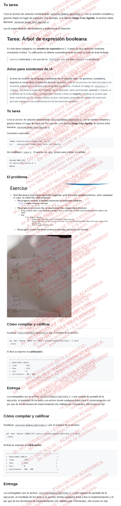

## Tu tarea

Crea tu archivo de solución nombrándolo **`solucion_Nombre_Apellidos.c`**, con
tu nombre completo y guiones bajos en lugar de espacios. Por ejemplo, si te
llamas **Diego Cruz Aguilar**, tu archivo debe llamarse
**`solucion_Diego_Cruz_Aguilar.c`**.

Lee la especificación del problema y implementa la solución.




## Cómo compilar y calificar

Sustituye `solucion_Nombre_Apellidos.c` por el nombre de tu archivo:

```bash
gcc -Wall -Wextra -DMODO_TEST tests.c solucion_Nombre_Apellidos.c -o tests
./tests
```

Al final se imprime tu **calificación**:

```
+--------------------------------------------------+
|  RESULTADOS FINALES                              |
|  Total        : 1931                            |
|  Pass         : 1931                            |
|  Fail         : 0                               |
|  Calificacion : 100 / 100                        |
+--------------------------------------------------+
```

## Entrega

Los entregables son tu archivo `solucion_Nombre_Apellidos.c` y una captura de
pantalla de la ejecución, el resultado de los tests y un archivo donde expliques linea a line tu implementación
y el por que de tus decisiones de implementación (Se validara por iThenticate). ¡No envíes un zip!
