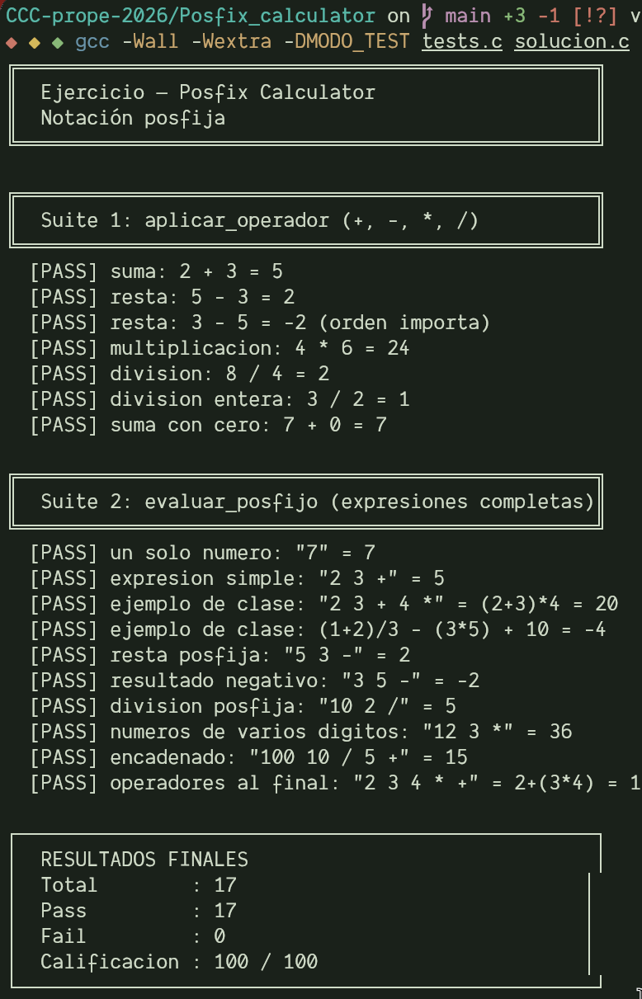

# Tarea: Posfix Calculator

En esta tarea implementarás una calculadora de **notación posfija** (postfix) en C. Tu calificación se obtiene automáticamente al correr la suite de tests incluida.

## Tu tarea

Debes crear un archivo llamado **`solucion.c`** (en esta misma carpeta) que implemente las siguientes dos funciones, exactamente con estas firmas:

```c
int aplicar_operador(int a, int b, char op);

int evaluar_posfijo(const char *expresion);
```

El archivo `tests.c` ya contiene los tests y el `main`; **no debes modificarlo**. Si quieres agregar un `main` propio a tu `solucion.c` (por ejemplo, para probar de forma interactiva), enciérralo así para que no choque con el de los tests:

```c
#ifndef MODO_TEST
int main(void) {
  return 0;
}
#endif
```

## Notación posfija

Los operadores van **después** de sus operandos y los numeros se separan por espacios:

| Entrada (posfija)          | Equivalente (infija)     | Resultado |
|----------------------------|--------------------------|-----------|
| `2 3 + 4 *`                | `(2 + 3) * 4`            | `20`      |
| `1 2 + 3 / 3 5 * - 10 +`   | `(1+2)/3 - (3*5) + 10`   | `-4`      |

## Reglas

- Lenguaje C.
- Solo puedes usar **pilas y/o colas** (las estructuras vistas en clase).
- Solo enteros (la división es entera: `3 / 2 = 1`).
- Solo los operadores `+`, `-`, `*`, `/`.
- No es necesario validar todo: puedes asumir que la cadena ingresada es correcta.

## Cómo compilar y calificar tu solución

```bash
gcc -Wall -Wextra -DMODO_TEST tests.c solucion.c -o tests
./tests
```

Al final se imprime tu **calificación**:

```
┌──────────────────────────────────────────────────┐
│  RESULTADOS FINALES                              │
│  Total        : 29                               │
│  Pass         : 29                               │
│  Fail         : 0                                │
│  Calificacion : 100 / 100                        │
└──────────────────────────────────────────────────┘
```

## Entrega

Los entregables son el archivo `solucion.c` y una captura de pantalla de la ejecucion y resultado de los test.

ejemplo de captura de pantalla:



